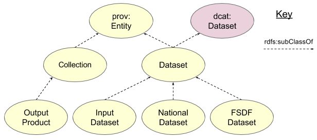

# Datasets

The LINK really centeres around datasets and is most concerned about certain properties of datasets and how they relate to other datasets, various agents (e.g. Agencies) and a few items fairly unique to LINK, such as Mandates.

  
Figure 01: Web Service <--> Dataset relations

Figure 01 shows the modelling of various types of Datasets within the LINK. Input, National and FSDF Datasets are all subclasses of the LINK's conception of a 'Dataset' which is both a prov:Entity and a dcat:Dataset. Being a prov:Entity, all LINK Datasets can have relations to Agents and other Entities, a-la-PROV. Being a dcat:Dataset, they also have some basic properties like titles, being in Catalogues and so on.

FSDF Output Products are seen as subclasses of prov:Collection as they are containers of FSDF Datasets, single not deliverable things themselves.

  
Figure 02: Datasets <--> Agents relations

LINK Datasets, and Output Products, as related to Agencies and other agents just as PROV relates prov:Entities to prov:Agents. Figure 02 shows a simple attribution relatinship wich isn't that useful as it doesn't tell you *how* that Dataset and Agent are related, only that they are. Figure 02, B. uses a PROV qualified relationship to indicate that a Dataset and an Agent are related and *how* they are related by giving the Agent a Role, in relation to that Dataset. In FSDF, the allowed roles are those taken from the ISO19115 RoleCode CodeList (see https://geo-ide.noaa.gov/wiki/index.php?title=ISO_19115_and_19115-2_CodeList_Dictionaries#CI_RoleCode for a web page version of the list). The figure lists the allowed values and then in subfigure C., a real example is shown which models Dataset 5444 (ACT Arboretum Forest)'s relationship to Agency 2246 (Environmental and Planning Directorate) where the Agency plays the role of aurole:Custodian.

  
Figure 03: Datasets <--> Mandates relations

Mandates are also modelled as prov:Entity objects but a particular kind of prov:Entity, a prov:Plan, and, more than than that, an agr:Agreement. A prov:Plans instruct someone - a prov:Agent - in some course of action and an agr:Agreement is a plan to do something between two Agents or groups of them. See the [Mandates page](mandates.md) for more information specifically about Mandates.
 
Given that both Datasets and Mandates are types of prov:Entity, they can be related through a generic prov:wasInfluenced by, which isn't that useful, but they can also be related through a qualified version of prov:wasInfluencedBy which this ontology calls wasMandatedBy where the Mandate makes the Dataset be produced.
