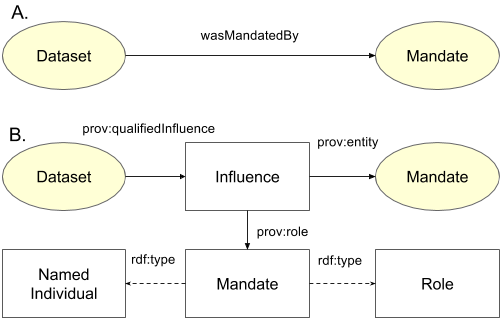

# Mandates

Mandates are the laws, acts or policies that require Agencies to deliver certain Datasets.

  
Figure 01: Mandate's superclasses relations

Figure 01 shows a Mandate modelled as a prov:Entity (a thing), more specifically a prov:Plan (a set of instructions), more specifically an agr:Agreement. An agr:Agreement is defined in the [Agreements ontology](http://promsns.org/def/agr) as "A description of a set of required actions by particular agents". Acts (of parliaments) are Agreements between the populous and the Agent or Group instructed to do something by the Act. In the case of FSDF, this will be an Agency instructed to produce a Dataset.
 
The Agreements ontology give constructs for explaining who makes Agreements, who they apply to, how they apply and what actions would be required to show compliance. For the LINK ontology, it's sufficient to just say that a Dataset *wasMandatedBy* a particular Mandate and, inversely, that a Mandate *wasMandateOf* a particular Dataset.

In general terms, a Dataset/Mandate relationship is a generic prov:wasInfluencedBy relationship where the Mandate had some unspecified incluence on the Dataset. If required for a modelling task, *wasMandatedBy* can thought of as equivalent to a prov:qualifiedInfluence relationship where the qualification is as per Figure 02.

  
Figure 02: A Mandate's relationship to a Dataset using  PROV qualification influence construction. Using wasMandatedBy is equivalent to saying prov:wasInfluencedBy where the type of influence is that of "Mandate".